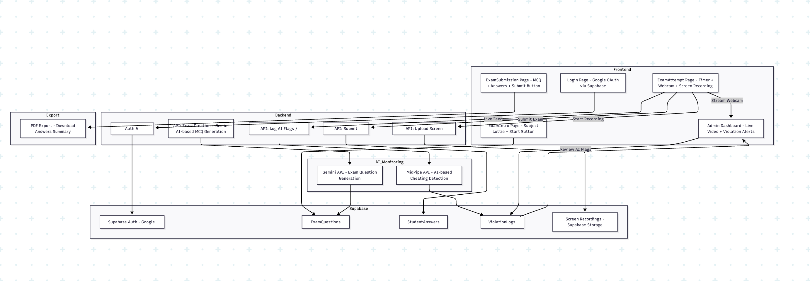

#  Examlytic – AI-Powered Online Exam Proctoring System.

Examlytic is a full-stack web application that enables online exams with real-time AI proctoring, video monitoring, screen recording, and admin dashboards for reviewing violations.

---

##  System Architecture

### Architecture Overview

- **Frontend**: React + Lottie + CSS
- **Backend**: Node.js + Express
- **Authentication**: Supabase Auth (Google OAuth)
- **Database**: Supabase PostgreSQL with Row Level Security (RLS)
- **Real-Time**: PeerJS + Socket.IO
- **Screen Recording**: MediaRecorder API
- **Storage**: Supabase Storage (for screen recordings)
- **Cheat Detection**: MidPipe API (AI flags & violation logs)

---

###  Component Breakdown

####  Student Side
- **Login** (via Google Auth)
- **ExamIntro**: Animated intro page (Lottie)
- **ExamAttempt**
  - Webcam stream (PeerJS)
  - Screen recording (MediaRecorder API)
  - Live timer + question rendering from Supabase
  - Submit functionality

####  Admin Side
- **Dashboard**:
  - See all current exam sessions
  - View live webcam stream
  - Access uploaded screen recording after exam ends
  - See AI violation report via MidPipe

---

###  Data Flow

1. User logs in via Supabase Auth
2. Exam info and questions are fetched securely (RLS ensures isolation)
3. During exam:
   - Webcam is streamed in real-time (WebRTC via PeerJS)
   - Screen is recorded and stored locally
   - Recording uploaded to Supabase Storage on submit
   - Video + screen are analyzed via MidPipe API for suspicious activity
4. Admin dashboard fetches:
   - Real-time stream
   - Past recording
   - AI-generated cheat flags

---

##  Security Measures

- ✅ Row Level Security to isolate exam & user data
- ✅ Supabase Auth with Google OAuth
- ✅ Peer-to-peer encrypted webcam stream
- ✅ Secure upload via signed URLs
- ✅ AI-assisted cheat detection instead of manual monitoring

---

##  Deployment & Scalability

| Layer      | Current Setup       | Scalable To                 |
|------------|---------------------|-----------------------------|
| Frontend   | Vite + React (Local)| Vercel / Netlify           |
| Backend    | Express (Local)     | Render / Railway / Fly.io  |
| DB         | Supabase PostgreSQL | Supabase (Auto-scalable)   |
| Streaming  | PeerJS              | WebRTC SFU (e.g. LiveKit)  |
| AI         | MidPipe API         | Custom ML pipeline (future)|

---

##  Future Enhancements

- [ ] Implement auto face detection alerts
- [ ] Switch from PeerJS to a more scalable SFU
- [ ] Add graph-based cheat analytics
- [ ] Offline exam saving & upload
- [ ] Multi-admin review dashboard

---

##  Testing Strategy

- ✅ Unit Testing: Key backend routes
- ✅ Manual Testing: All proctoring flows
- 🚧 E2E Testing: To be added with Cypress

---

##  Dev Stack

- **React**
- **Node.js**
- **Supabase**
- **Socket.IO**
- **PeerJS**
- **Vite**
- **Lottie**
- **MediaRecorder API**

---

##  Folder Structure

```bash
.
├── public/
├── src/
│   ├── Components/
│   ├── Pages/
│   ├── utils/
│   └── styles/
├── vite.config.js
├── package.json

```

🤝 Contributing
If you're interested in contributing or reviewing architecture, feel free to open an issue or submit a pull request!

