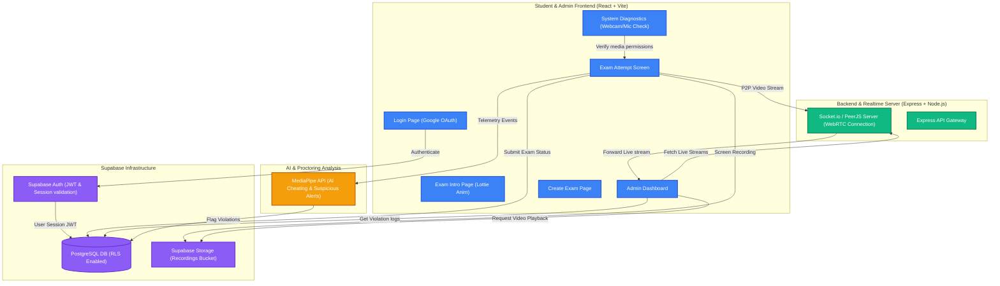

<div align="center">

# 🛡️ Examlytic

### AI-Powered Online Exam Proctoring Platform

*Real-time webcam monitoring, screen recording, and AI cheat detection — with a full admin command center.*

[](https://examlyticmain.netlify.app/)
[](https://react.dev/)
[](https://vitejs.dev/)
[](https://supabase.com/)
[](https://www.tensorflow.org/js)
[](https://livekit.io/)

</div>

---

## 📖 Overview

Examlytic lets institutions run secure online exams with live AI proctoring. Students authenticate, pass a hardware/identity check, and sit the exam under continuous webcam + screen monitoring — while admins watch every session unfold in real time and review AI-flagged violations afterward.

## ✨ Features

| | Feature | Details |
|---|---|---|
| 🔐 | **Institutional Auth** | Google Workspace / OAuth login via Supabase Auth |
| 🧪 | **Hardware Diagnostics** | Pre-exam webcam, mic, and screen-share checks before entry is allowed |
| 🪪 | **Identity Verification** | Face detection & calibration step to confirm the right person is sitting the exam |
| 📹 | **Live Proctoring** | Real-time webcam + screen streaming to admins via LiveKit/PeerJS |
| 🧠 | **AI Cheat Detection** | MediaPipe + TensorFlow.js models flag suspicious face/pose/object behavior |
| 📝 | **Exam Runner** | Question navigation, flag-for-review, scratchpad, and live countdown timer |
| 📊 | **Admin Dashboard** | Live session grid, warning logs, infrastructure health, and analytics |
| 🗂️ | **Recording Review** | Screen recordings uploaded to Cloudinary for post-exam review |
| 🛡️ | **Row Level Security** | Supabase RLS isolates every student's exam data |

## 📸 Walkthrough

<table>
<tr>
<td width="50%">

**1️⃣ Secure Login**
Students sign in with their institution-managed Google Workspace account over an encrypted session.

</td>
<td width="50%">

</td>
</tr>

<tr>
<td width="50%">

**2️⃣ Exam Access Code**
Students enter their unique exam code, confirm they're on a verified account, and check connection quality before proceeding.

</td>
<td width="50%">

</td>
</tr>

<tr>
<td width="50%">

**3️⃣ Hardware & Identity Diagnostics**
Webcam, mic, and screen-share are tested live, with face detection calibration before the browser lock activates.

</td>
<td width="50%">

</td>
</tr>

<tr>
<td width="50%">

**4️⃣ Live Exam Session**
Question navigation, a scratchpad, an equation helper, flag-for-review, and a persistent live webcam feed — all while the proctor watches the shared screen.

</td>
<td width="50%">

</td>
</tr>

<tr>
<td width="50%">

**5️⃣ Admin Command Center**
Proctors monitor every active session, view AI-generated warning logs, and track infrastructure health in real time.

</td>
<td width="50%">

</td>
</tr>
</table>

## 🧱 Tech Stack

<div align="center">
<table>
<tr>
<td align="center" width="110"><br/><sub><b>React 19</b></sub></td>
<td align="center" width="110"><br/><sub><b>Vite</b></sub></td>
<td align="center" width="110"><br/><sub><b>MUI</b></sub></td>
<td align="center" width="110"><br/><sub><b>styled-components</b></sub></td>
<td align="center" width="110"><br/><sub><b>JavaScript</b></sub></td>
<td align="center" width="110"><br/><sub><b>Node.js</b></sub></td>
</tr>
<tr>
<td align="center"><br/><sub><b>Supabase</b></sub></td>
<td align="center"><br/><sub><b>PostgreSQL</b></sub></td>
<td align="center"><br/><sub><b>LiveKit</b></sub></td>
<td align="center"><br/><sub><b>PeerJS</b></sub></td>
<td align="center"><br/><sub><b>TensorFlow.js</b></sub></td>
<td align="center"><br/><sub><b>MediaPipe</b></sub></td>
</tr>
<tr>
<td align="center"><br/><sub><b>Cloudinary</b></sub></td>
<td align="center"><br/><sub><b>Groq</b></sub></td>
<td align="center"><br/><sub><b>ESLint</b></sub></td>
<td align="center"><br/><sub><b>npm</b></sub></td>
<td align="center"><br/><sub><b>Git</b></sub></td>
<td align="center"><br/><sub><b>Netlify</b></sub></td>
</tr>
</table>
</div>

| Layer | Technology |
|---|---|
| Frontend | React 19, Vite, MUI, styled-components |
| Auth | Supabase Auth (Google OAuth) |
| Database | Supabase (PostgreSQL + Row Level Security) |
| Real-time streaming | LiveKit, PeerJS |
| AI / computer vision | TensorFlow.js, MediaPipe (face detection, pose, tasks-vision) |
| Media storage | Cloudinary |
| Screen recording | MediaRecorder API, RecordRTC |
| AI text services | Groq API |

## 🏗️ System Architecture

### Data Flow Diagram


```mermaid
graph TD
    %% Styling
    classDef client fill:#3b82f6,stroke:#1d4ed8,stroke-width:2px,color:#fff;
    classDef server fill:#10b981,stroke:#047857,stroke-width:2px,color:#fff;
    classDef thirdparty fill:#f59e0b,stroke:#b45309,stroke-width:2px,color:#fff;
    classDef database fill:#8b5cf6,stroke:#6d28d9,stroke-width:2px,color:#fff;
    
    %% Subgraphs
    subgraph Client_Layer ["Student & Admin Frontend (React + Vite)"]
        Login["Login Page (Google OAuth)"]
        Diagnostics["System Diagnostics (Webcam/Mic Check)"]
        ExamIntro["Exam Intro Page (Lottie Anim)"]
        ExamAttempt["Exam Attempt Screen"]
        AdminDashboard["Admin Dashboard"]
        CreateExam["Create Exam Page"]
    end
    
    subgraph Service_Layer ["Backend & Realtime Server (Express + Node.js)"]
        Signaling["Socket.io / PeerJS Server (WebRTC Connection)"]
        ProctorBackend["Express API Gateway"]
    end
    
    subgraph Database_Layer ["Supabase Infrastructure"]
        DB[("PostgreSQL DB (RLS Enabled)")]
        Auth["Supabase Auth (JWT & Session validation)"]
        Storage["Supabase Storage (Recordings Bucket)"]
    end
    
    subgraph AI_Layer ["AI & Proctoring Analysis"]
        MediaPipe["MediaPipe API (AI Cheating & Suspicious Alerts)"]
    end
    
    %% Apply Styles
    class Login,Diagnostics,ExamIntro,ExamAttempt,AdminDashboard,CreateExam client;
    class Signaling,ProctorBackend server;
    class DB,Auth,Storage database;
    class MediaPipe thirdparty;
    
    %% Data Flow Connections
    Login -->|Authenticate| Auth
    Auth -->|User Session JWT| DB
    Diagnostics -->|Verify media permissions| ExamAttempt
    ExamAttempt -->|P2P Video Stream| Signaling
    Signaling -->|Forward Live stream| AdminDashboard
    
    ExamAttempt -->|Screen Recording| Storage
    ExamAttempt -->|Submit Exam Status| DB
    
    AdminDashboard -->|Fetch Live Streams| Signaling
    AdminDashboard -->|Request Video Playback| Storage
    AdminDashboard -->|Get Violation logs| DB
    
    %% AI Pipeline
    ExamAttempt -->|Telemetry Events| MediaPipe
    MediaPipe -->|Flag Violations| DB
```

### Student Flow
1. 🔑 Log in via Google (Supabase Auth)
2. 🧪 Pass hardware diagnostics & identity calibration
3. ✍️ Attempt the exam — webcam stream + screen recording run continuously, questions load from Supabase, live timer counts down
4. ☁️ On submit, the recording uploads to Cloudinary and the session is queued for AI review

### Admin Flow
- 🖥️ View every active exam session in real time
- 📡 Watch live webcam streams per student
- 🎬 Review uploaded screen recordings after the exam ends
- 🚩 See AI-generated violation/cheat flags per student

## 📁 Project Structure

```
.
├── public/
├── src/
│   ├── Components/       # Reusable UI (Navbar, Footer, LiveMonitoring, etc.)
│   ├── Pages/              # Route-level pages (AdminDashboard, ExamAttempt, Login, etc.)
│   ├── hooks/                # Custom React hooks (e.g. useAuth)
│   ├── utils/                 # Helpers (Cloudinary, Groq service)
│   ├── assets/                 # Images, Lottie animations
│   └── SupabaseClient.js       # Supabase client setup
├── supabase/functions/            # Supabase Edge Functions
├── vite.config.js
└── package.json
```

## 🚀 Getting Started

### Prerequisites
- Node.js 18+
- A [Supabase](https://supabase.com/) project
- A [Cloudinary](https://cloudinary.com/) account
- A [Groq](https://groq.com/) API key

### Installation

```bash
git clone https://github.com/Shlokmonster/Examlytic-main.git
cd Examlytic-main
npm install
```

### Environment Variables

Copy `.env.example` to `.env` and fill in your credentials:

```bash
cp .env.example .env
```

```env
# Cloudinary Configuration
VITE_CLOUDINARY_CLOUD_NAME=your_cloud_name_here
VITE_CLOUDINARY_UPLOUD_PRESET=your_upload_preset_here

# Supabase Configuration
VITE_SUPABASE_URL=your_supabase_url_here
VITE_SUPABASE_ANON_KEY=your_supabase_anon_key_here

# Groq API Key
VITE_GROQ_API_KEY=your_groq_api_key_here
```

### Run locally

```bash
npm run dev       # start the dev server
npm run build      # production build
npm run preview     # preview the production build
npm run lint       # run ESLint
```

## 🔒 Security

- ✅ Row Level Security (RLS) isolates exam and user data at the database level
- ✅ Google OAuth via Supabase Auth
- ✅ Peer-to-peer, encrypted webcam streaming
- ✅ Signed URLs for secure media uploads
- ✅ AI-assisted cheat detection instead of manual-only monitoring

## 🗺️ Roadmap

- [ ] Automated face-detection alerts
- [ ] Migrate to a scalable SFU for streaming
- [ ] Graph-based cheat analytics
- [ ] Offline exam saving & upload
- [ ] Multi-admin review dashboard
- [ ] End-to-end testing with Cypress

## 🤝 Contributing

Contributions are welcome! If you'd like to improve the architecture or add a feature, open an issue to discuss it or submit a pull request directly.

## 📄 License

No license specified yet — check with the repository owner before reuse.
